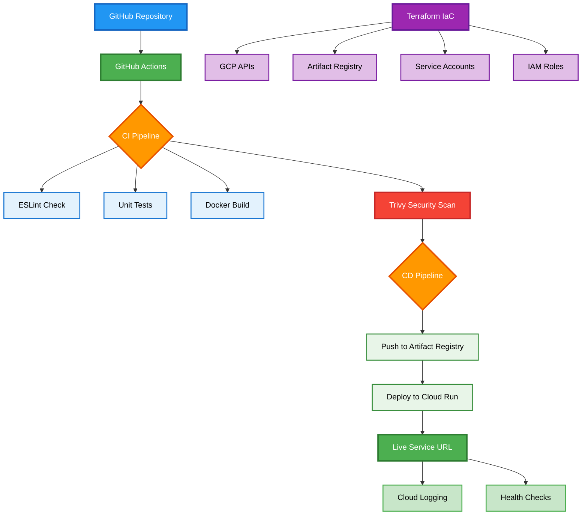

# simple-web-api-devops-flows
DevOps Take Home Technical Challenge
Last demo: Mon Sep  1 03:08:28 +07 2025

# DevOps Interview Task - Hello World API


##  Live Demo
**Service URL:** 

##  Overview
A simple Node.js "Hello World" API demonstrating modern DevOps practices with automated CI/CD pipeline, containerization, and cloud deployment on Google Cloud Platform.

### API Endpoints
- `GET /` → `{"status": "ok"}`
- `GET /health` → Health check with timestamp

##  Architecture


### Technology Stack
- **API**: Node.js 18 + Express.js
- **Container**: Docker (multi-stage, non-root)
- **Registry**: Google Artifact Registry
- **Hosting**: Google Cloud Run (serverless)
- **GCP-set-up**: Terraform
- **CI/CD**: GitHub Actions
- **Security**: Trivy vulnerability scanning
- **Monitoring**: Google Cloud Logging

## 🛠️ Setup Instructions

### Prerequisites
```bash
# Required tools
- Node.js 18+
- Docker
- gcloud CLI
- terraform
- GitHub account
- GCP project with billing enabled
```
### Local Development
```bash
# Clone repository
git clone https://github.com/Kenhalo/simple-web-api-devops-flows
cd devops-interview-task

# Install dependencies
npm install

# Run tests
npm test

# Start development server
npm run dev

# Test locally
curl http://localhost:8080
curl http://localhost:8080/health
```
### GCP set up
```bash
cd terraform
# Initialize Terraform
terraform init

# Validate configuration
terraform validate

# See what will be created
terraform plan

# Deploy infrastructure 
terraform apply
```

### 🔧 CI/CD Pipeline
Continuous Integration
- Code linting (ESLint)
- Unit testing (Jest)
- Docker build
- Security scanning (Trivy)

Continuous Deployment (main branch only)
- Multi-stage Docker build
- Push to Artifact Registry (versioned + latest)
- Deploy to Cloud Run
- Health check validation
- Zero-downtime deployment

### Triggering Deployment
```bash
git add .
git commit -m "Your changes"
git push origin main  # Triggers automatic deployment
```

## 🔒 Security Features

### Container Security
-Non-root user execution (nodejs:1001)
-Multi-stage build (reduced attack surface)
-Vulnerability scanning with Trivy
-Distroless base image alternatives considered

### Access Control
-Least-privilege IAM roles
-Service account authentication
-No hardcoded secrets
-GitHub Secrets for sensitive data

### IAM Roles Used
-artifactregistry.writer - Push container images
-run.admin - Deploy Cloud Run services
-iam.serviceAccountUser - Service account impersonation

💰 Cost Estimate

### Monthly Costs (Free Tier)
-Cloud Run: $0 (2M requests/month free)
-Artifact Registry: ~$0.10 (1GB storage)
-Cloud Logging: $0 (50GB/month free)
-Total: < $1/month 📈

### Scaling Costs
-Cloud Run: $0.000024/request after free tier
-Additional storage: $0.10/GB/month

## 🎯 Manual Operations
### View Deployments
```bash 
# List Cloud Run services
gcloud run services list --region=asia-southeast1

# View service details
gcloud run services describe hello-world-api --region=asia-southeast1
```

### Manual Rollback
```bash
# List revisions
gcloud run revisions list --service=hello-world-api --region=asia-southeast1

# Rollback to previous revision
gcloud run services update-traffic hello-world-api \
  --to-revisions=REVISION_NAME=100 \
  --region=asia-southeast1
```

### View Logs
```bash
# Real-time logs
gcloud logs tail "resource.type=cloud_run_revision"

# Recent logs
gcloud logs read "resource.type=cloud_run_revision" --limit=50
```

## 📊 Monitoring & Observability
### Health Monitoring
-Built-in Cloud Run health checks
-Custom /health endpoint
-Docker HEALTHCHECK instruction

### Logging
-Structured JSON logging
-Request/response logging
-Error tracking
-Performance metrics

### Metrics Available
-Request latency
-Request count
-Error rates
-Container CPU/Memory usage
-Instance scaling events

## 🏆 Technical Decisions
### Why Node.js over Python?
-Faster cold start times (good for Cloud Run)
-Smaller container images
-Native JSON handling
-Simple dependency management

### Why GitHub Actions over Cloud Build?
-Better integration with GitHub
-Easier secret management
-Cost-effective for this scale

### Why Terraform?
* Infrastructure as Code - Reproducible and versioned
* State management - Tracks resource dependencies
* Planning - Preview changes before applying
* Professional standard - Industry best practice
* Team collaboration - Shareable infrastructure definitions

📝 Project completed in ~10 hours as requested